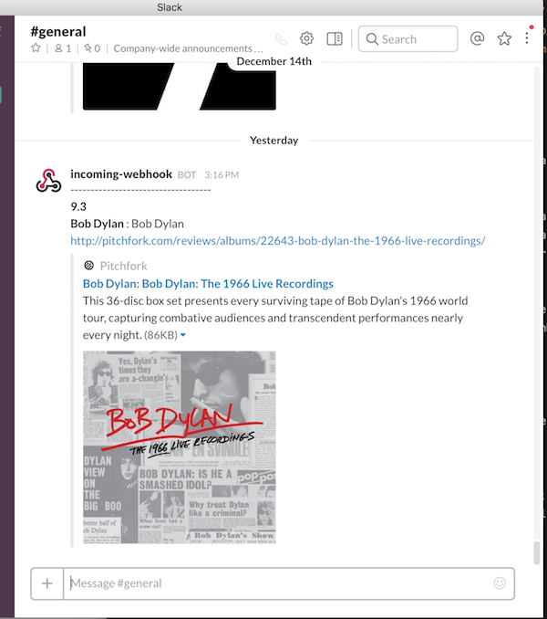

# pitchfork_notifier
This program notifies information of albums in Pitchfork to a slack channel when the program find out albums which these scores are higher than you set.

## Requirements
It can work on Lambda Function and API-Gateway. Also, It is used DynamoDB and adopted Serverless Framework and Babel(ES2016, ES2017). 

